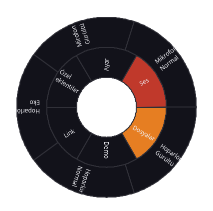
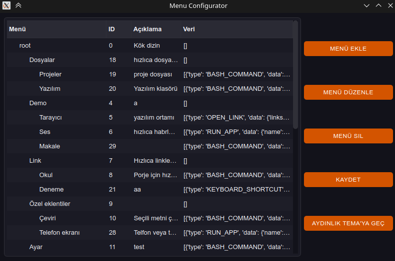

# QuickShortcutPanel



**QuickShortcutPanel**, Linux sistemlerde fare konumunda açılan dairesel bir kısayol paneli sağlayan PyQt6 tabanlı bir uygulamadır. Uygulamalarınıza, komutlarınıza ve eylemlerinize hızlı erişim için sezgisel bir arayüz sunar.

## ✨ Özellikler

- 🎯 **Fare Konumunda Açılma**: Panel, fare konumunda açılır
- 🔄 **Dairesel Menü Sistemi**: Çok katmanlı, dairesel menü yapısı
- ⚡ **Çoklu Eylem Türleri**:
  - Bash komutları çalıştırma
  - Klavye kısayolları gönderme
  - Web sitelerini açma
  - Uygulamaları başlatma
  - Özel eklentiler çalıştırma
- 🎨 **Tema Desteği**: Karanlık ve aydınlık tema seçenekleri
- 🔧 **Grafik Yapılandırma**: Kullanıcı dostu ayar arayüzü
- 📦 **Eklenti Sistemi**: Hazır eklentiler ve özel eklenti desteği

## 📸 Ekran Görüntüleri

| Ana Panel | Ayar Ekranı |
|-----------|-------------|
|  |  |

## 🚀 Kurulum

### Sisteme Kurulum (Debian/Ubuntu)

```bash
# Gerekli bağımlılıkları yükleyin
sudo apt install xdotool python3-pyqt6 python3-coloredlogs python3-yaml python3-xdg

# Depo'yu klonlayın
git clone https://github.com/bismih-org/QuickShortcutPanel.git
cd QuickShortcutPanel

# Paketi derleyin ve kurun
sudo apt install devscripts git-buildpackage
sudo mk-build-deps -ir
gbp buildpackage --git-export-dir=/tmp/build/bismih-welcome -us -uc --git-ignore-branch --git-ignore-new
```

### Geliştirme Ortamı

```bash
# Bağımlılıkları yükleyin
sudo apt install xdotool python3-pyqt6 python3-coloredlogs python3-yaml python3-xdg

# Veya pip ile
pip install -r requirements.txt

# Uygulamayı çalıştırın
python3 main.py
```

## 🎮 Kullanım

### Ana Panel

1. **Paneli Açma**: 
   ```bash
   quick-shortcut-panel
   ```
   veya geliştirme ortamında:
   ```bash
   python3 main.py <x_koordinat> <y_koordinat>
   ```

2. **Navigasyon**:
   - Fare ile parçaların üzerine gelin
   - Alt menülere erişmek için bekleyin
   - Tıklayarak eylemleri çalıştırın
   - `ESC` tuşu ile çıkış

### Yapılandırma

```bash
quick-shortcut-panel-config
```

veya geliştirme ortamında:
```bash
python3 main_config.py
```


## ⚙️ Yapılandırma

### Menü Yapısı

Menüler [data/menu.json](data/menu.json) dosyasında JSON formatında saklanır:

```json
{
  "title": "Menü Adı",
  "id": 1,
  "description": "Açıklama",
  "data": [
    {
      "type": "BASH_COMMAND",
      "data": {
        "command": "dolphin",
        "is_terminal": false
      }
    }
  ],
  "children": []
}
```

### Eylem Türleri

#### 1. Bash Komutları
```json
{
  "type": "BASH_COMMAND",
  "data": {
    "command": "code .",
    "is_terminal": false
  }
}
```

#### 2. Klavye Kısayolları
```json
{
  "type": "KEYBOARD_SHORTCUT",
  "data": {
    "ctrl": true,
    "alt": false,
    "shift": false,
    "meta": true,
    "key": "E"
  }
}
```

#### 3. Link Açma
```json
{
  "type": "OPEN_LINK",
  "data": {
    "links": [
      "https://github.com/",
      "https://google.com"
    ]
  }
}
```

#### 4. Uygulama Çalıştırma
```json
{
  "type": "RUN_APP",
  "data": {
    "name": "Visual Studio Code",
    "exec": "/usr/share/code/code %F"
  }
}
```

## 🔌 Eklenti Sistemi

### Hazır Eklentiler

Hazır eklentiler [data/prepared_plugins/](data/prepared_plugins/) klasöründe JSON dosyalar olarak saklanır:

```json
[
  {
    "type": "BASH_COMMAND",
    "data": {
      "command": "flatpak run com.github.wwmm.easyeffects -l normal",
      "is_terminal": false
    }
  }
]
```

### Özel Eklentiler

Özel eklentiler [data/special_plugins/](data/special_plugins/) klasöründe ayrı klasörler halinde saklanır:

```
data/special_plugins/my_plugin/
├── plugin.json          # Eklenti meta verisi
├── main.py             # Ana Python dosyası
└── my_plugin.py        # Eklenti kodu
```

**plugin.json** örneği:
```json
{
  "plg_mng_version": "0.1",
  "title": "Benim Eklentim",
  "description": "Eklenti açıklaması",
  "author": "Geliştirici",
  "version": "1.0.0",
  "website": "https://github.com/author/plugin",
  "license": "GPL-3.0",
  "dependencies": {
    "apt": ["package1", "package2"],
    "flatpak": ["com.example.App"]
  }
}
```

## 🎨 Tema Sistemi

Uygulama karanlık ve aydınlık tema desteği sunar. Temalar [data/theme.qss](data/theme.qss) dosyasında QSS (Qt Style Sheets) formatında tanımlanır.

### Tema Renkleri

- **Ana Vurgu**: `#d35400` (Turuncu)
- **Hover**: `#e67e22` (Açık Turuncu)
- **Pressed**: `#c0392b` (Koyu Turuncu-Kırmızı)

## 📂 Proje Yapısı

```
QuickShortcutPanel/
├── main.py                     # Ana uygulama
├── main_config.py             # Yapılandırma uygulaması
├── t.py                       # Test dosyası
├── data/                      # Veri dosyaları
│   ├── menu.json             # Menü yapılandırması
│   ├── theme.qss             # Tema stilleri
│   ├── prepared_plugins/     # Hazır eklentiler
│   └── special_plugins/      # Özel eklentiler
├── src/                      # Kaynak kod
│   ├── ui/                   # Kullanıcı arayüzü
│   │   ├── panel/           # Ana panel
│   │   ├── menu_config/     # Yapılandırma UI
│   │   └── theme/           # Tema yöneticisi
│   ├── process/             # İş mantığı
│   ├── static/              # Sabit veriler
│   └── common/              # Ortak yardımcılar
└── debian/                  # Debian paket dosyaları
```

## 🛠️ Geliştirme

### Gereksinimler

- Python 3.8+
- PyQt6
- pyautogui
- coloredlogs
- pyyaml
- pyxdg

### Katkıda Bulunma

1. Projeyi fork edin
2. Yeni bir branch oluşturun (`git checkout -b feature/amazing-feature`)
3. Değişikliklerinizi commit edin (`git commit -m 'Add some amazing feature'`)
4. Branch'inizi push edin (`git push origin feature/amazing-feature`)
5. Pull Request oluşturun

### Debug

Test için:
```bash
python3 t.py
```

Loglama:
```python
from src.common.Logging import Log
logger = Log()
logger.log("Debug mesajı", "d")
```


## 📜 Lisans

Bu proje [MIT Lisansı](LICENSE) altında lisanslanmıştır.

## 👥 Yazarlar

- **Muhammet Halak** - *Ana Geliştirici* - [halakmuhammet145@gmail.com](mailto:halakmuhammet145@gmail.com)

- **Abdullah Sina Korkmaz** - *Katkıda Bulunan*

## 🔗 Bağlantılar

- [GitHub Repository](https://github.com/bismih-org/QuickShortcutPanel)
- [Issue Tracker](https://github.com/bismih-org/QuickShortcutPanel/issues)
<!-- - [Pardus Forum](https://forum.pardus.org.tr/) -->


---
