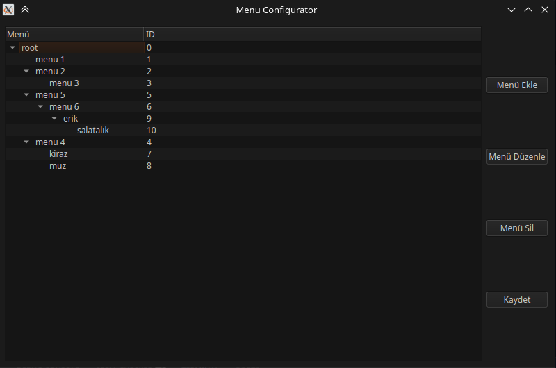

# Kısayol

# Geliştirme için
```console
sudo apt install xdotool python3-pyqt6 python3-coloredlogs python3-yaml python3-xdg
```



# Yapılacaklar

- [ ] Easyeffect ile hazır efekt uygulama
- [ ] Aynı and birden çok uygulama açma
- [ ] Belli kısayolları açma
- [ ] Otomatik rahatsız etme modu açma
- [ ] Belli kısayolları pencere olarak gösterme
- [ ] Çeviri uygulaması entegre etme
- [ ] Dosya açıcı
- [ ] Kde connect ile telefon bağlantısı
- [ ] Scrcpy ile ekran paylaşımı
- [ ] Site açma
- [ ] En çok ram kullanan uygulamaları listeleyip kill etme


- [ ] Başlangıçta temel tanıtım
- [ ] Ayarlar kısmında config içindeki ayarları düzenleme

